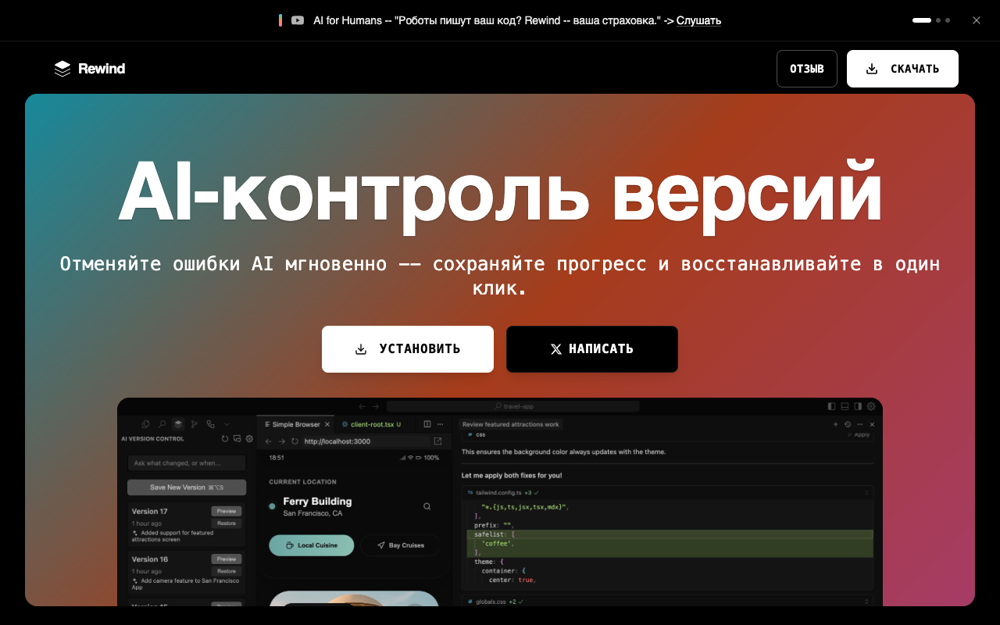

# Rewind - AI-контроль версий

Лендинг для инструмента контроля версий кода при работе с AI-ассистентами. Позволяет сохранять, просматривать и восстанавливать код после изменений AI в один клик. Включает hero-секцию с градиентом, список поддерживаемых IDE, секции с видео-демонстрациями, отзывы пользователей и FAQ.

`"tags": ["landing", "dark", "ai", "developer", "gradient", "animations"]`
